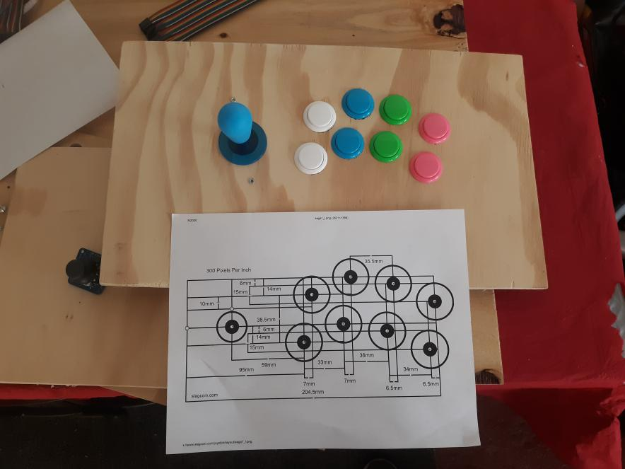
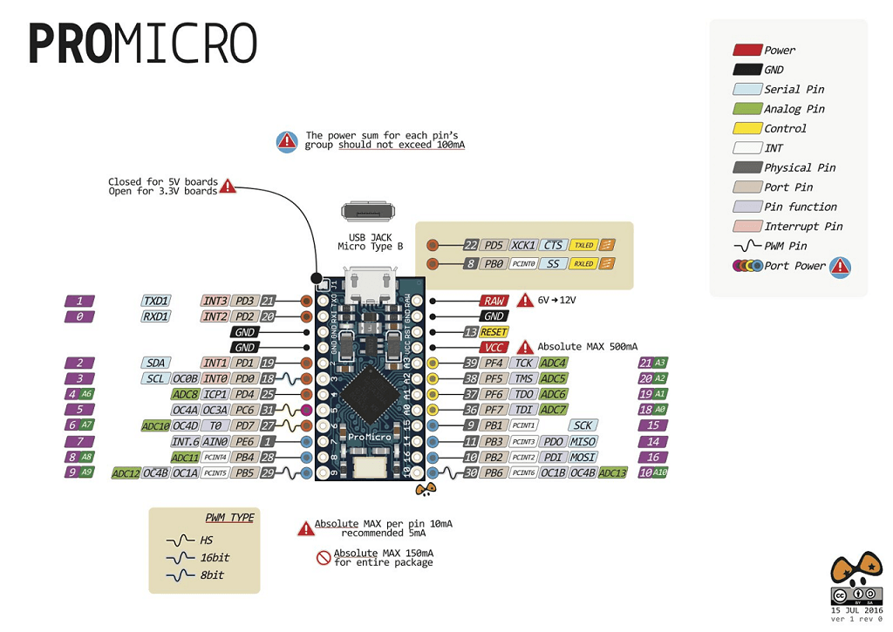
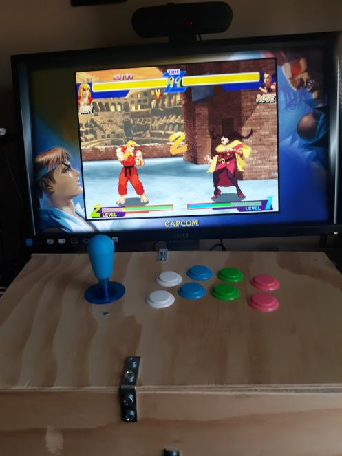
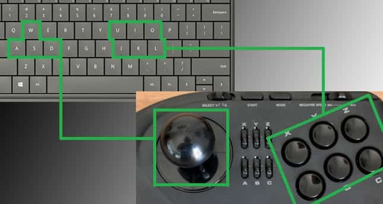

# Arduino-Micro-Mini-Gamepad

This project was inspired from a my previous fightstick project, which used the tiva c tm4c123 
https://github.com/SnrNotHere16/ArcadeStickWithScreen
My motivation was to create a fightstick that I could be fighitng games like street fighter. 
Although my fight stick worked perfectly on emulators, it did not register properly on steam. 
Because I could not get the fightstick to work, I figured that if I created an hid keyboard 
device then steam should be able to register the commands properly. 
# Arduino-Micro-Mini-Keyboard on Steam 

Here is an image of me using the gamepad on Street Fighter 30th Anniversary Collection

Here is an image of the keys assigned to each button though I may change this in the future. 
